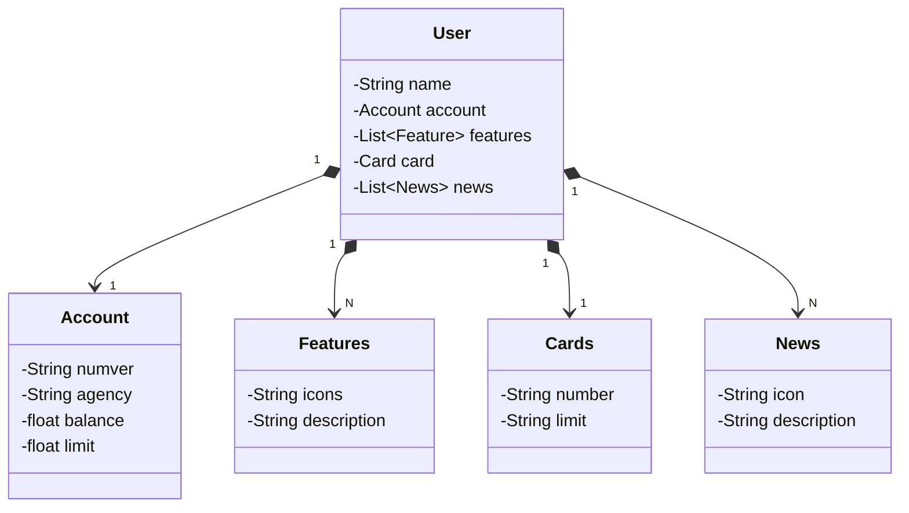

#  Santander Dev Week 2024
## 📊 Diagrama de Classes

```mermaid
classDiagram
    class User {
        -String name
        -Account account
        -List~Feature~ features
        -Card card
        -List~News~ news
    }
    
    class Account {
        -String numver
        -String agency
        -float balance
        -float limit
    }
    
    class Features {
        -String icons
        -String description
    }
    
    class Cards {
        -String number
        -String limit
    }
    
    class News {
        -String icon
        -String description
    }
    
    User "1" *--> "1" Account
    User "1" *--> "N" Features
    User "1" *--> "1" Cards
    User "1" *--> "N" News
```
